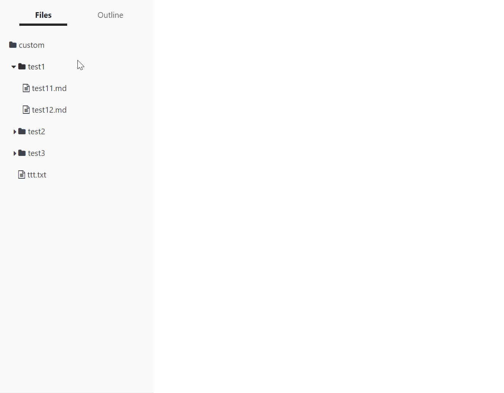
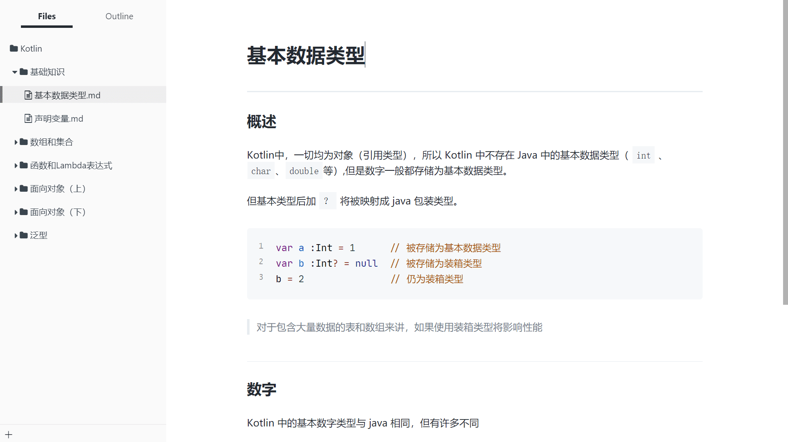

# Typora 扩展

> 注意：jquery文件是修改过的，不要替换，参考[如何在electron中使用jquery](https://blog.csdn.net/baidu_27280587/article/details/54378420)

> 扩展需要修改源文件，asar解压软件位于utils文件夹下

## 文件顺序扩展

[扩展安装步骤](fileOrder/安装步骤.md)

`Typora`的默认文件排序是按照字母或者修改时间来排序，这个扩展可以指定特定的文件顺序

> 使用该扩展，会在目录下自动生成`order.json`文件，用来记录文件顺序

## gitbook 样式扩展

[gitbook样式扩展安装步骤](gitbook/安装说明.md)

这个 `gitbook`样式是我仿造`gitbook`网站的`markdown`样式，既然只是样式，为什么还要扩展文件？不是用``css`文件和字体文件就好了吗？

因为`gitbook`样式中，`h2`标签的分割线在上方，`h1`标签的分割线在下方，如果`h2`紧跟在`h1`后面，`h2`的分割线就会消失（不然很难看）。而这个效果只靠`css`没法实现，所以还需要`javascript`代码。

